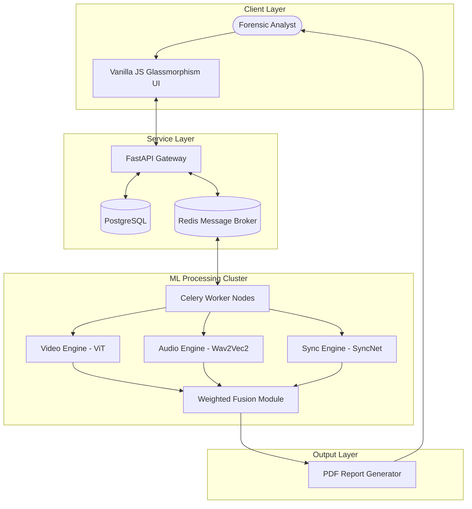
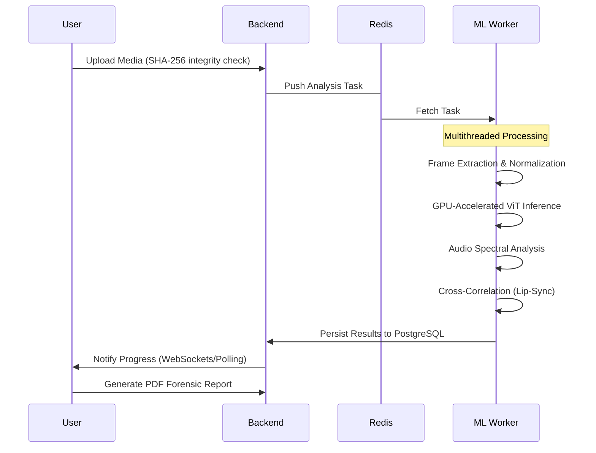

# 🛡️ DeepFakeShield AI: Multimodal Forensic Platform
## Technical Dissertation & Presentation Guide

> **Author:** Vanshika Tangri (Student No: 2315843)
> **Course:** AI-4-Creativity
> **Objective:** Comprehensive detection of manipulated media using multimodal AI analysis.

---

## 📖 1. Project Overview & Motivation
DeepFakeShield AI is an advanced forensic ecosystem designed to address the escalating threat of synthetic media. Unlike heuristic-based detectors, it leverages a **multimodal consensus mechanism** that analyzes the three primary dimensions of digital video:
1. **Visual Consistency** (Spatial & Temporal)
2. **Acoustic Authenticity** (Voice Synthesis & Cloning)
3. **Audio-Visual Alignment** (Lip-Sync Synchronization)

### The "Truth Score" Philosophy
The platform doesn't just output a binary "Fake" or "Real" label. It provides a **Forensic Confidence Score** based on calibrated probabilities across all modalities, allowing human investigators to verify the findings through an interactive evidence timeline.

---

## 🛠️ 2. Comprehensive Technology Stack

### A. AI & Machine Learning Infrastructure
| Component | Technology | Detail |
| :--- | :--- | :--- |
| **Video Model** | **ViT-B/16** | 12 Transformer layers, 12 heads, 768 hidden dim. |
| **Audio Model** | **Wav2Vec2** | Self-supervised learning on raw waveforms for spoof detection. |
| **Sync Model** | **SyncNet** | CNN-based cross-correlation for lip-audio alignment. |
| **Inference** | **PyTorch 2.0+** | Accelerated with CUDA/ROCm where available. |
| **Computer Vision** | **OpenCV & PIL** | Optimized frame extraction and spatial preprocessing. |

### B. Scalable Backend Architecture
| Component | Technology | Role |
| :--- | :--- | :--- |
| **API Layer** | **FastAPI** | High-concurrency async endpoints (Pydantic V2). |
| **Task Queue** | **Celery + Redis** | Distributed processing to handle heavy 4K video analysis. |
| **Database** | **PostgreSQL** | Relational storage for forensic metadata and user logs. |
| **Authentication** | **JWT (OAuth2)** | Secure stateless authentication for forensic analysts. |

---

## 🏗️ 3. Advanced System Architecture

### Distributed Processing Model
DeepFakeShield is designed to run in containerized environments, allowing the ML Worker to scale independently of the API server.

---

## 🧠 4. The Science Behind Detection

### Phase 1: Spatial & Temporal Feature Learning
Our **Vision Transformer (ViT)** model views a frame as a sequence of 16x16 patches. This allows the model to learn:
- **Boundary Inconsistencies:** Artifacts at the seam where a fake face meets a real body.
- **Subtle Texture Blurring:** Deepfake generators often struggle with skin pores and micro-expressions.
- **GAN Signatures:** Spectral patterns left by Generative Adversarial Networks.

### Phase 2: Audio Spoof Detection
Using **Wav2Vec2**, the system analyzes the raw waveform to detect:
- **Formant Anomalies:** Variations in vocal tract resonance that differ from human speech.
- **Phase Inconsistencies:** Discontinuities in synthetic audio segments.
- **Silence Analysis:** Artifacts in the quiet segments of a voice-cloned clip.

### Phase 3: Cross-Modal Alignment (Lip-Sync)
The system calculates the **Correlation Coefficient** between the visual movement of the lips and the acoustic phonemes. A mismatch in timing (Lip-Sync lag) is a high-confidence indicator of a "Deepfake Reenactment" or "Voice Over Dubbing."

---

## 📊 5. Multimodal Fusion Logic
The final verdict is calculated using a **Confidence-Weighted Ensemble**:

$$Score = \frac{\sum (ModalityScore_i \times Confidence_i)}{\sum Confidence_i}$$

| Modality | Default Weight | Key Artifacts Detected |
| :--- | :--- | :--- |
| **Video** | 45% | Eye blinking anomalies, facial jitter, boundary noise. |
| **Audio** | 30% | Spectral gaps, robotic resonance, pitch-shifting artifacts. |
| **Lip-Sync** | 25% | Audio-Visual lag, phoneme-viseme mismatch. |

---

## 🔄 6. Process Lifecycle

---

## 📈 7. Reliability & Forensic Integrity

### Anti-Adversarial Measures
- **Input Sanitization:** Verifies MIME types and file signatures to prevent polyglot file attacks.
- **Data Integrity:** Every analysis result is linked to the **SHA-256 hash** of the original file to ensure chain of custody.
- **Explainability:** The platform highlights the specific **Evidence Segments** where the manipulation was most likely detected.

### Future Improvement Roadmap
1. **Active Learning Loop:** Retraining models automatically on newly discovered deepfake variations (e.g., Diffusion-based faces).
2. **Blockchain Notarization:** Registering authenticity certificates on a public ledger for immutable proof.
3. **Real-time Stream Analysis:** Extending the platform to monitor live video broadcasts for synthetic content injection.

---

## 📄 8. Conclusion
DeepFakeShield AI represents a significant step forward in the fight against digital misinformation. By combining state-of-the-art transformer architectures with traditional signal processing, it provides a comprehensive defense mechanism for the modern era.

---
*DeepFakeShield AI: Protecting Truth in the Age of Synthetic Media*
