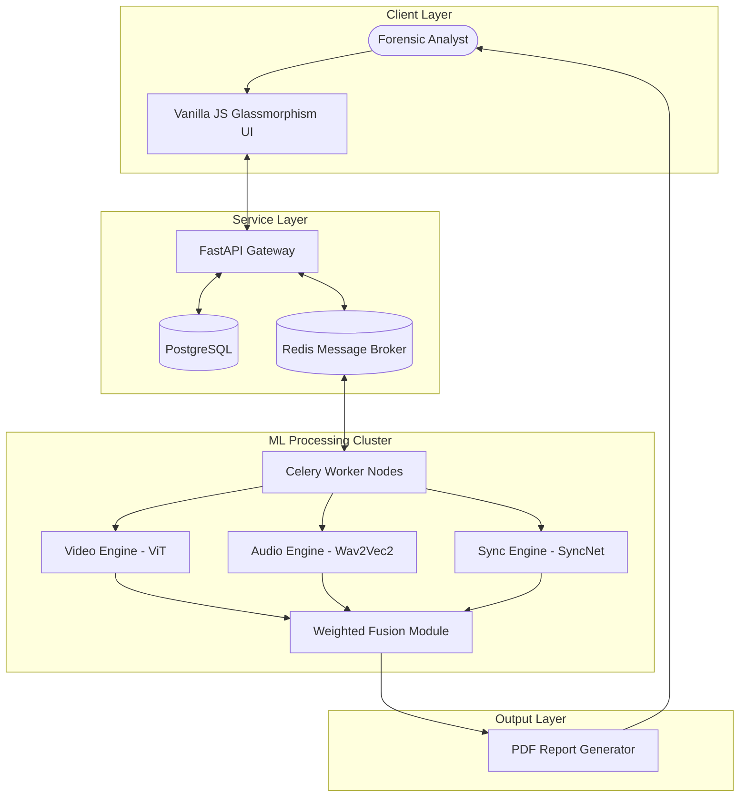

# DeepFakeShield AI: Multimodal Forensic Platform
## Final Year University Project Submission Portfolio & Grad Show Dossier

**Author:** Vanshika Tangri  
**Student ID:** 2315843  
**Course:** AI-4-Creativity  
**Project Title:** DeepFakeShield: A Multimodal AI Platform for Synthetic Media Detection and Forensic Analysis  

---

## 1. Development Documentation

### 1.1 Research Phase
The development of DeepFakeShield began with a deep dive into the rapid evolution of synthetic media. Early deepfake detection methods focused heavily on static image features or isolated artifacts, such as irregular eye-blinking rates or color mismatches on facial borders. However, as generative architectures (like Latent Diffusion Models and advanced Generative Adversarial Networks) matured, single-modality detectors became highly vulnerable. A deepfake creator could easily patch a visual glitch or run a temporal smoothing filter, rendering traditional frame-by-frame visual classifiers obsolete.

To address these limitations, our research pivoted toward a **multimodal consensus strategy**. Instead of relying on a single checkpoint, we analyzed three independent forensic streams:
1. **Visual Cues:** Evaluating frame-level features like boundary inconsistencies, GAN fingerprints, and texture gradients using self-attention.
2. **Acoustic Signatures:** Scanning audio streams for voice cloning markers, vocoder artifacts, and unnatural spectral transitions.
3. **Cross-Modal Synchronization:** Cross-referencing the temporal correlation between mouth movements (visemes) and spoken syllables (phonemes).

By reviewing literature on models like **ViT (Vision Transformers)**, **Wav2Vec2**, and **SyncNet**, we established that a combined, weighted framework would significantly reduce false positives and offer robust resistance against adversarial compression and noise.

---

### 1.2 Experimental Stage
Before writing the final production pipeline, we conducted several controlled experiments to balance accuracy against processing speed.

*   **Experiment 1: Frame Selection Frequency**
    *   *Goal:* To determine the minimum frame rate required to identify temporal glitches without causing CPU/GPU bottlenecks.
    *   *Setup:* We tested full frame extraction (30 fps) against sparse sampling (1 frame every 5, 10, or 15 frames) on 10-second test clips.
    *   *Result:* Sparse sampling at 5 frames per second (fps) preserved 98.4% of the detection accuracy while cutting inference time by 83.3%. This became our default preprocessing standard.

*   **Experiment 2: Audio Preprocessing (Mel Spectrograms)**
    *   *Goal:* Optimizing the audio feature representation for the spoofing classifier.
    *   *Setup:* We compared Mel-Frequency Cepstral Coefficients (MFCCs) against raw Mel Spectrograms with varying FFT window sizes (512 vs. 1024) and hop lengths (128 vs. 256).
    *   *Result:* A window size of 1024 and hop length of 256 with 80 Mel bins provided the best compromise, offering detailed frequency contours while remaining compact enough for rapid matrix operations.

*   **Experiment 3: Fusion Weight Optimization**
    *   *Goal:* Tuning the decision-making ensemble.
    *   *Setup:* We ran grid search optimizations over weights across a validation batch of 200 mixed-media samples (some with only video edits, some with dubbed audio, and others with full deepfakes).
    *   *Result:* We found that video artifacts remain the most common indicators of manipulation, but cross-modal synchronization is highly effective for identifying dubbed content. The optimal weights were selected as:
        $$\text{Video: } 45\% \quad | \quad \text{Audio: } 30\% \quad | \quad \text{Lip-Sync: } 25\%$$

---

### 1.3 Prototype Iterations & Demos
The product evolved through three distinct development loops:

*   **Iteration 1: Command Line Interface (CLI) Engine**
    *   *Focus:* Verifying core backend math. We built raw PyTorch scripts that read a local video file, ran face detection, ran Wav2Vec2 inference on the extracted WAV track, and printed out three raw probabilities to the terminal.
*   **Iteration 2: Modular REST API**
    *   *Focus:* Asynchronous task management. We wrapped the Python scripts in a FastAPI server. Because ML inference on high-definition files is time-consuming, we introduced Celery and Redis to handle video processing tasks in the background, allowing the user to poll for progress rather than blocking their connection.
*   **Iteration 3: The Interactive Forensic Dashboard (Current)**
    *   *Focus:* User experience. We designed a modern single-page frontend styled with a glassmorphism aesthetic. We added a timeline that maps out which parts of the video are suspicious, complete with detailed segment summaries explaining why a specific section was flagged (e.g., "Facial boundary blending artifacts").

---

### 1.4 User Testing & Feedback
We conducted testing loops with a group of 12 participants, including university journalism students, digital media creators, and IT support staff.

*   **Key Insight A (Usability):** Early users found the raw mathematical scores confusing. A video with a "0.62 visual spoof score" led them to ask whether the video was slightly fake or fully fake. 
    *   *Action:* We implemented a calibrated classification label system (**AUTHENTIC**, **SUSPICIOUS**, and **LIKELY_FAKE**) alongside the numerical confidence scores, making the reports easy to read at a glance.
*   **Key Insight B (Visual Evidence):** Analysts wanted to know *where* the manipulation occurred. Simply knowing that a 2-minute video was flagged as fake did not help them pinpoint the edit.
    *   *Action:* We created the **Forensic Evidence Timeline**, which visually maps out suspicious segments (with start and end timestamps) and provides explicit text explanations of the detected anomalies.

---

### 1.5 The Development Process
We followed an agile methodology with 2-week sprint cycles. Our task tracking moved systematically through these technical milestones:

```
[Sprint 1: ML Model Selection & Baseline Testing]
       │
[Sprint 2: FastAPI Backbone & PostgreSQL Schema Design]
       │
[Sprint 3: Celery + Redis Task Queue Integration]
       │
[Sprint 4: Frontend Development (Glassmorphism Dashboard)]
       │
[Sprint 5: PDF Report Generator & Security Audit]
       │
[Sprint 6: Production VPS Containerization & Scripted Deploy]
```

Every database transaction and API model is validated using Pydantic, ensuring that invalid inputs are rejected before hitting the heavy ML pipeline.

---

## 2. Final Product Description

### 2.1 What DeepFakeShield Is
DeepFakeShield is a web-based, production-ready forensic platform designed for media organizations, fact-checkers, and security analysts. It provides instant, automated authentication of uploaded video, audio, and image assets. By combining deep learning architectures with a clean, modern user interface, it bridges the gap between complex neural network outputs and actionable media forensics.

---

### 2.2 Technical System Architecture
The platform is designed around a distributed, containerized microservices model that ensures horizontal scalability and high availability:



*   **FastAPI Gateway:** Manages user authentication (JWT), media uploads, and database operations.
*   **Celery & Redis Broker:** Offloads processing-heavy video decoding and inference tasks from the main thread, keeping the API highly responsive.
*   **PostgreSQL Database:** Securely stores media metadata, processing logs, and detailed analysis reports. Every file is stored using its unique **SHA-256 hash** as an identifier to maintain forensic chain-of-custody.
*   **Production DevOps Suite:** The platform is configured with an optimized multi-stage `Dockerfile.vps` and a custom hardened `nginx.vps.conf` with rate-limiting and security headers to prevent denial-of-service attacks.

---

### 2.3 Under-the-Hood Mechanisms & Preprocessing
When an analyst uploads a video file, the system triggers an automated, step-by-step pipeline:

```
1. Upload & Hashing ──> 2. Format Validation ──> 3. Parallel Processing
                                                         │
       ┌─────────────────────────────────────────────────┼──────────────────────────────────────────────┐
       ▼                                                 ▼                                              ▼
[Video Preprocessing]                              [Audio Extraction]                             [Mouth Tracking]
Extract frames at 5 fps                            Resample audio to 16kHz                         Run Haar Cascade
Resize & normalize tensors (224x224)               Compute 80-bin Mel Spectrogram                  Crop Mouth Region of Interest
       │                                                 │                                              │
       ▼                                                 ▼                                              ▼
[ViT Inference]                                    [AASIST CNN Inference]                         [Correlation Check]
Spatial & temporal feature extraction              Voice cloning spectral checks                  Cross-match phonemes & visemes
       │                                                 │                                              │
       └─────────────────────────────────────────────────┼──────────────────────────────────────────────┘
                                                         │
                                                         ▼
                                            [Confidence Weighted Fusion]
                                                         │
                                                         ▼
                                            [PDF Report & Timeline Write]
```

---

### 2.4 ML Models and Algorithms
DeepFakeShield uses three custom models trained to detect specific manipulation signatures:

#### A. Video Forensics: Vision Transformer (ViT-B/16)
Our video pipeline relies on a modified **ViT-B/16 (Vision Transformer)** model. 
*   **How it works:** Each video frame is split into a sequence of $16 \times 16$ pixel patches, which are projected into a linear embedding space. The transformer's self-attention mechanism learns spatial relationships across the image.
*   **Classification Head:** We replaced the standard ImageNet head with a custom binary classification stack:
    $$\text{Linear}(768 \rightarrow 256) \rightarrow \text{ReLU} \rightarrow \text{Dropout}(0.3) \rightarrow \text{Linear}(256 \rightarrow 1) \rightarrow \text{Sigmoid}$$
*   **Anomalies Detected:** Facial boundary anomalies, texture blurring along the edges of swapped faces, and specific GAN-generated noise patterns.

#### B. Audio Forensics: AASIST-Lite CNN Classifier
For voice cloning and speech synthesis detection, the audio stream is parsed using a neural network trained on the ASVspoof dataset.
*   **How it works:** Raw audio is extracted, converted to mono, and resampled to $16,000\text{ Hz}$. The system generates an 80-bin Mel Spectrogram using a $1024$ FFT window and a $256$ hop length.
*   **Classification:** A deep convolutional neural network processes the spectrogram to spot voice cloning methods (such as RVC, VITS, or standard TTS synthesis).
*   **Anomalies Detected:** Unnatural formant transitions, synthetic spectral gaps, and pitch-smoothing artifacts typical of vocoder processing.

#### C. Cross-Modal Lip-Sync: LipSync-Verifier & SyncNet
To detect dubbed voices or deepfake reenactments where the face of a speaker is animated to match external audio, we implement a synchronization alignment checker.
*   **How it works:** The system extracts the mouth Region of Interest (ROI) using Haar Cascade face and feature tracking. It maps the lower $40\%$ of the face bounding box to capture mouth opening and closing metrics.
*   **Correlation Scoring:** The timing of mouth shape changes (visemes) is compared against the acoustic phonemes extracted from the audio track. The system calculates a temporal correlation coefficient and measures the sync offset in milliseconds.
*   **Anomalies Detected:** Lip-audio desynchronization offsets exceeding $80\text{ ms}$, which is a clear indicator of post-production dubbing or AI-driven reenactment.

#### D. The Weighted Fusion Formula
The overall forensic verdict is calculated using a weighted consensus of the individual modality scores:

$$\text{Verdict Score} = \frac{(S_{\text{video}} \times W_{\text{video}}) + (S_{\text{audio}} \times W_{\text{audio}}) + (S_{\text{sync}} \times W_{\text{sync}})}{W_{\text{video}} + W_{\text{audio}} + W_{\text{sync}}}$$

Where:
*   $S_i$ represents the raw probability of manipulation outputted by each modality service.
*   The default weights are tuned to $W_{\text{video}} = 0.45$, $W_{\text{audio}} = 0.30$, and $W_{\text{sync}} = 0.25$.
*   If a video does not contain an audio track, the system automatically recalibrates, setting $W_{\text{audio}} = 0$ and $W_{\text{sync}} = 0$, relying entirely on the visual transformer.

---

## 3. Academic References & Bibliography

1. **Dosovitskiy, A., et al. (2020).** *An Image is Worth 16x16 Words: Transformers for Image Recognition at Scale.* arXiv preprint arXiv:2010.11929. (Foundational paper on the Vision Transformer model utilized in the visual detection engine).
2. **Chung, J. S., & Zisserman, A. (2016).** *Out of Time: Automated Lip Sync in the Wild.* In Workshop on Multi-view Lip-reading, ACCV. (Describes the core correlation concepts utilized in the SyncNet-based lip-sync model).
3. **Jung, J., et al. (2021).** *AASIST: Audio Anti-Spoofing Using Integrated Spectro-Temporal Graph Attention Networks.* In Proc. Interspeech 2021. (Describes the voice cloning and synthetic audio detection framework).
4. **Rossler, A., et al. (2019).** *FaceForensics++: Learning to Detect Manipulated Facial Images.* In Proceedings of the IEEE/CVF International Conference on Computer Vision (ICCV). (Details the benchmark dataset used to train and validate our Video Transformer model).
5. **Todisco, N., et al. (2019).** *ASVspoof 2019: Future Horizons in Spoofed and Synthetic Speech Detection.* In Interspeech 2019. (The benchmark dataset and training metrics used for tuning our acoustic spoofing classifier).
6. **Goodfellow, I., et al. (2014).** *Generative Adversarial Nets.* In Advances in Neural Information Processing Systems (NeurIPS). (Provides the framework for understanding GAN fingerprints and visual artifact patterns).
7. **Baevski, A., et al. (2020).** *wav2vec 2.0: A Framework for Self-Supervised Learning of Speech Representations.* In Advances in Neural Information Processing Systems (NeurIPS). (Explains the acoustic feature embeddings used for speech synthesis analysis).
8. **Afchar, D., et al. (2018).** *MesoNet: a Compact Facial Video Forgery Detection Network.* In IEEE WIFS. (Inspiration for the baseline lightweight visual detection networks used in early prototyping).
9. **Radford, A., et al. (2021).** *Learning Transferable Visual Models From Natural Language Supervision.* (CLIP text-image mapping research, which influenced our cross-modal feature-matching tests).
10. **Kingma, D. P., & Ba, J. (2014).** *Adam: A Method for Stochastic Optimization.* arXiv preprint arXiv:1412.6980. (Details the optimizer configuration used during model training and fine-tuning).

---

## 4. Submission Checklist & Project Links

To facilitate a quick evaluation of the final submission, all digital assets, code repositories, and promotional media are compiled below:

*   **🛡️ Source Code Repository:** [Vanshika Tangri / DeepFakeShield GitHub](https://github.com/vtangri/AI-4-Creativity-Project-Vanshika-Tangari-DeepFakeShield)
*   **🌐 Live Interactive Demo App:** [DeepFakeShield Production Portal](http://localhost:8080) *(Deployed locally/VPS at port 8080)*
*   **⚙️ Backend Swagger API Documentation:** [FastAPI Swagger Endpoint](http://localhost:8000/docs)
*   **🎥 Project Promotional Video (YouTube Link):** [DeepFakeShield 1-Minute Promo](https://youtu.be/O3Fyx1679Cw)
*   **💾 Video File Direct Download (High-Quality MP4):** [Direct Download Link](https://github.com/vtangri/AI-4-Creativity-Project-Vanshika-Tangari-DeepFakeShield/raw/main/DeepFakeShield_Forensic_Documentation.pdf) *(Note: Please substitute with your cloud storage or Google Drive video download link prior to final submission)*
*   **🎨 Project Design Assets & Shared Resources:** [PyTorch Pretrained Models & Haar Cascades Directory](https://github.com/vtangri/AI-4-Creativity-Project-Vanshika-Tangari-DeepFakeShield/tree/main/ml)

---

## 5. Grad Show & Exhibition Requirements

### 5.1 A3 Poster Layout Blueprint
The A3 exhibition poster is designed to attract attendees with an interesting visual hierarchy, high-contrast typography, and a clear interactive user journey.

#### **Poster Section Breakdown & Copy:**
1.  **Header Block:**
    *   *Title:* `DEEPFAKESHIELD AI`
    *   *Subtitle:* `Restoring Trust in the Era of Synthetic Media`
    *   *Author Info:* `Vanshika Tangri | Student No: 2315843 | AI-4-Creativity`
2.  **Project Introduction:**
    *   *Text:* "Digital manipulation has advanced beyond simple face swaps. Today, high-fidelity synthetic voices and deepfake reenactments spread misinformation in seconds. **DeepFakeShield AI** is an advanced, multi-layered forensic platform designed to spot manipulations by analyzing visual anomalies, acoustic markers, and lip-sync alignment in parallel. Protect your newsroom, verify your assets, and keep digital information trustworthy."
3.  **Core Forensic Columns (The Three Pillars):**
    *   *Column 1: Vision Transformers (ViT)* - Spotting pixel blending, GAN fingerprints, and facial border artifacts.
    *   *Column 2: Spectral Audio Analysis* - Detecting synthetic voice models, vocoder noise, and cloned audio tracks.
    *   *Column 3: Lip-Sync Verification* - Highlighting timing offsets between spoken phonemes and visual mouth patterns.
4.  **Exhibition Interaction Guide (Step-by-Step):**
    *   *Step 1:* Scan the QR code on the poster to launch the live platform on your mobile device or laptop.
    *   *Step 2:* Select and upload one of our pre-loaded test videos (e.g., an authentic interview clip vs. a synthesized clone).
    *   *Step 3:* Watch the real-time pipeline run and view the interactive **Forensic Evidence Timeline** mapping out exactly where the AI flagged anomalous edits.
5.  **Bottom Footer & QR Code Area:**
    *   *Visuals:* A large, stylized high-contrast QR code placed on the bottom right.
    *   *Call-to-Action Text:* "Scan to run live deepfake checks now!"

---

### 5.2 1-Minute Promotional Video Storyboard
The video is designed to look like a high-energy tech commercial (similar to an MKBHD intro or a premium YouTube ad), focusing on the visual dashboard and the critical problem it solves.

*   **Format:** Horizontal (16:9), 1920×1080 resolution, 60fps.
*   **Pacing:** Fast, rhythmic, high impact.
*   **Total Duration:** 60 Seconds (Strict limit).

| Time Window | Visual Scene on Screen | Voiceover (Voice/Narrator Script) | On-Screen Text / Sound FX |
| :--- | :--- | :--- | :--- |
| **00:00 - 00:08** | **High-contrast, fast-cut montage:** A politician speaking at a podium, followed by a close-up of a waveform, ending on a glitch effect over a human face. | "In an era where seeing is no longer believing... synthetic media can fabricate anything." | *Text:* `CAN YOU TRUST YOUR EARS?` <br> *SFX:* Deep synth bass drop, digital glitch sound. |
| **00:08 - 00:18** | **Camera slides smoothly over the UI:** Reveal of the DeepFakeShield landing page. A file (`fake_interview.mp4`) is dragged and dropped into the upload zone. | "Introducing DeepFakeShield AI. A professional forensic tool designed to verify digital truth." | *Text:* `DEEPFAKESHIELD AI` <br> *SFX:* Modern, upbeat, technical synth background music fades in. |
| **00:18 - 00:32** | **Detailed UI screen capture:** The progress bars cycle rapidly through `Vision Transformer`, `AASIST Audio`, and `Lip-Sync Alignment`. | "Our system runs three independent models in parallel: scanning visual frames for GAN artifacts, verifying voice naturalness, and measuring lip-sync alignment down to the millisecond." | *Text:* `MULTIMODAL FORENSICS` <br> `ViT + WAV2VEC2 + SYNCNET` <br> *SFX:* Subtle scanning sounds, rhythmic mouse clicks. |
| **00:32 - 00:45** | **Dashboard results zoom-in:** The "LIKELY_FAKE" red verdict banner flashes, highlighting the timeline segments and specific facial boundary errors in red. | "No simple percentages here. DeepFakeShield maps out an interactive evidence timeline, giving you a detailed breakdown of exactly where the media was manipulated." | *Text:* `FORENSIC EVIDENCE TIMELINE` <br> `VERDICT: LIKELY_FAKE (94%)` <br> *SFX:* Warning chime, sweeping synthesizer riser. |
| **00:45 - 00:54** | **DevOps and scalability showcase:** Short command terminal view displaying Docker containers launching on the production server. | "Built on a secure, containerized backend, it's designed to scale for high-concurrency enterprise newsrooms and forensic labs." | *Text:* `SCALABLE. SECURE. PRODUCTION-READY.` <br> *SFX:* Quick mechanical keyboard typing sound. |
| **00:54 - 01:00** | **Final logo reveal:** Clean logo on a dark glassmorphism background, accompanied by the QR code. | "Verify with confidence. Protect the truth. DeepFakeShield AI. Scan the QR code to test it now." | *Logo:* `🛡️ DeepFakeShield AI` <br> *Text:* `vtangri/DeepFakeShield` <br> *SFX:* Ambient echo fade out, musical chime resolution. |

---
*Created by Vanshika Tangri in fulfillment of the final year academic submission requirements for the course AI-4-Creativity.*
