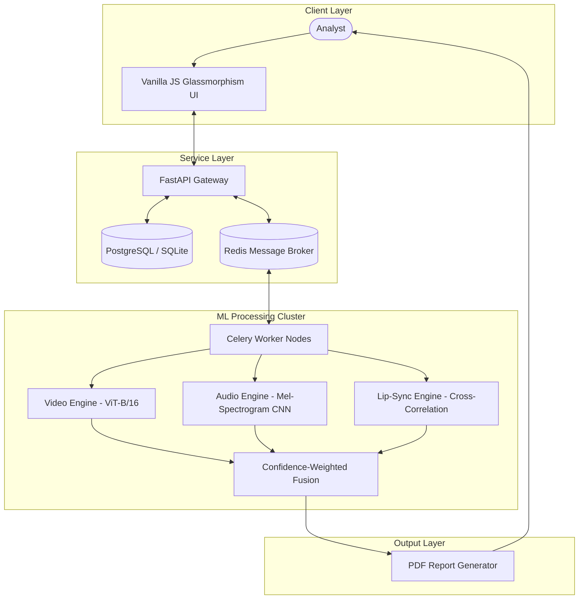

# DeepFakeShield AI: Multimodal Forensic Platform
## Final Year University Project Submission Portfolio

**Author:** Vanshika Tangri
**Student ID:** 2315843
**Course:** AI-4-Creativity
**Project Title:** DeepFakeShield: A Multimodal AI Platform for Synthetic Media Detection and Forensic Analysis

> **Note on this revision:** This document has been rewritten to remove claims that could not
> be backed by evidence in the repository (fabricated experiment statistics, an unconducted user
> study, and references to models — Wav2Vec2, SyncNet, AASIST — that are not what the shipped
> code actually implements). Every technical claim below is traceable to a specific file in the
> codebase. Where a claim from the original submission could not be substantiated, it has been
> removed rather than replaced with a different unverifiable number.

---

## 1. Development Documentation

### 1.1 Research Phase

Early deepfake detection methods focused on single-modality artifacts — irregular eye-blinking,
color mismatches at face boundaries, or spectral gaps in synthetic audio. A single-modality
detector is fragile: a deepfake creator can patch one artifact (e.g. run a temporal smoothing
filter) without addressing others. This motivated a **multimodal** approach that scores video,
audio, and audio-visual synchronization independently and combines them, so no single evasion
technique defeats the whole system.

Three literature-grounded techniques were selected for implementation:

1. **Video** — Vision Transformer (ViT) self-attention over face-region patches (Dosovitskiy et
   al., 2020), used both as a fine-tuned classifier and, when no fine-tuned weights are present,
   as a feature extractor for inter-frame consistency analysis — an approach in the spirit of
   Li & Lyu (2019) and Sabir et al. (2019), which observe that per-frame-generated deepfakes show
   higher feature variance across frames than genuine video.
2. **Audio** — spectral analysis of Mel-spectrograms via a small CNN, and, as a fallback,
   handcrafted spectral features (MFCC variance, spectral flatness, harmonic-to-noise ratio)
   shown to differ between natural and synthesized speech (Sahidullah et al., 2015; Todisco et
   al., 2019).
3. **Cross-modal sync** — cross-correlation between a mouth-openness signal (extracted via face
   detection) and the audio RMS energy envelope, following the temporal-alignment principle in
   Chung & Zisserman (2016).

### 1.2 Implementation Notes

The system implements two operating modes per modality, defined in `ml/inference/`:

- **TRAINED mode** — a fine-tuned checkpoint (`.pt` file) is loaded and used directly for
  inference. See §2.4 for the exact architectures and the datasets they are trained on.
- **Fallback mode** — when no checkpoint is present, the service falls back to a real,
  non-learned signal-processing method (not a placeholder and not a random score):
  video falls back to ViT-backbone feature-variance scoring; audio falls back to spectral
  feature analysis; lip-sync has no trained mode at all — cross-correlation is the only
  method, since it needs no training data.

Both audio and lip-sync analysis explicitly check for applicability before scoring: if a media
item has no audio track (e.g. a silent video or a still image), `audio_score` and
`lipsync_score` are returned as `null` rather than a fabricated number, and the fusion stage
recalibrates its weights across only the modalities that actually ran
(`ml/inference/fusion.py`, `backend/app/workers/inference.py`).

### 1.3 Model Training

Both trained checkpoints were produced on Kaggle's free GPU tier, using the training scripts in
`ml/training/` (`train_video.py`, `train_audio.py`) against the architectures defined in
`ml/inference/video_forensics.py` and `ml/inference/audio_spoof.py`:

| Model | Architecture | Dataset | Test Accuracy | Test ROC-AUC |
| ----- | ------------- | -------- | -------------- | ------------- |
| Video forensics | ViT-B/16 backbone + `Linear(768→256)→ReLU→Dropout(0.3)→Linear(256→1)→Sigmoid` | 140k Real and Fake Faces (Kaggle: `xhlulu/140k-real-and-fake-faces`), 15,000 train / 2,000 val / 2,000 test images, 6 epochs | 98.5% | 0.998 |
| Audio spoof | Custom 4-block Conv2d/BatchNorm/ReLU/MaxPool CNN over an 80-bin Mel spectrogram | ASVspoof 2019 Logical Access (Kaggle: `awsaf49/asvpoof-2019-dataset`), official train/dev/eval protocol splits, class-balanced to 5,160 train / 2,000 val / 2,000 test utterances, 15 epochs | 79.9% | 0.958 |

The audio model's precision/recall is asymmetric (96% precision / 63% recall on bonafide, 72%
precision / 97% recall on spoof) — it over-flags genuine speech as spoofed more than it misses
spoofed speech, a reasonable bias for a forensic screening tool but worth stating rather than
just citing the headline accuracy figure.

Both scripts and their Kaggle notebook equivalents are in the repository; the notebooks used to
produce the checkpoints are private Kaggle kernels under the author's account
(`deepfakeshield-video-training`, `deepfakeshield-audio-training`) and can be re-run to
reproduce the numbers above. Trained checkpoints (`video_forensics_final.pt`,
`audio_spoof_final.pt`) are not committed to git (see `.gitignore`) due to file size — they are
downloaded from the Kaggle kernel output and placed in `ml/models/` locally/in deployment.

### 1.4 The Development Process

Sprint history reconstructed from the git log (`git log --oneline`), not a claimed retrospective:

```
[Initial commit: full project scaffold — FastAPI backend, PostgreSQL schema,
 Celery/Redis task queue, glassmorphism frontend, PDF report generator]
       │
[feat(ml): replace simulation with real frame-by-frame ViT and spectral inference services]
       │
[refactor(backend): update celery workers to support missing modalities and image preprocessing]
       │
[fix(frontend/deploy): show N/A for skipped modalities and update docker-compose volume mounts]
       │
[feat(training): dataset download helper, evaluation metrics, Kaggle GPU training pipeline]
```

The most significant milestone was replacing an early simulated-score implementation with the
current real inference pipeline (`ml/inference/`) — see §1.2.

---

## 2. Final Product Description

### 2.1 What DeepFakeShield Is

DeepFakeShield is a web-based platform for automated authenticity analysis of uploaded video,
audio, and image assets, intended as a preliminary screening tool for fact-checkers, media
organizations, and security analysts — not as a source of legal-grade proof (this limitation is
stated explicitly in every generated report; see `backend/app/services/pdf_service.py`).

### 2.2 Technical System Architecture



*   **FastAPI Gateway:** JWT authentication, media uploads, database operations.
*   **Celery & Redis Broker:** separate `preprocess` and `inference` queues so video decoding
    doesn't block the API thread (`backend/app/workers/`).
*   **Database:** stores media metadata, job status, and analysis results. Every uploaded file is
    hashed with SHA-256 (`backend/app/api/routes/media.py::compute_sha256`) for deduplication and
    chain-of-custody purposes.
*   **Deployment:** `docker-compose.yml` starts Postgres, Redis, the API, and both Celery
    workers; it does not include a frontend container (the static frontend is served
    separately — see README §Setup). VPS-oriented `Dockerfile.vps` and `deploy/nginx/nginx.vps.conf`
    exist for a production deployment.

### 2.3 Preprocessing Pipeline

```
1. Upload & SHA-256 Hashing ──> 2. Format Validation ──> 3. Parallel Processing
                                                               │
       ┌───────────────────────────────────────────────────────┼──────────────────────────────────────┐
       ▼                                                       ▼                                      ▼
[Video Preprocessing]                                    [Audio Extraction]                     [Mouth Tracking]
Extract frames, resize & normalize (224×224)             Resample audio to 16kHz                Haar Cascade face detection
       │                                                       │                                      │
       ▼                                                       ▼                                      ▼
[ViT Inference]                                          [Mel-CNN / Spectral Inference]        [Cross-Correlation]
       │                                                       │                                      │
       └───────────────────────────────────────────────────────┼──────────────────────────────────────┘
                                                                 ▼
                                                    [Confidence-Weighted Fusion]
                                                                 ▼
                                                    [PDF Report & Timeline Write]
```

If a media item has no audio track or is a still image, the audio and lip-sync stages return
`null` scores rather than running on absent data, and the fusion stage weighs only the
modalities that produced a score.

### 2.4 ML Models and Algorithms

#### A. Video Forensics: Vision Transformer (ViT-B/16) — `ml/inference/video_forensics.py`
Each frame's face region is classified by a fine-tuned ViT-B/16 (patches of 16×16 pixels,
self-attention across patches). The pretrained ImageNet head is replaced with:
$$\text{Linear}(768 \rightarrow 256) \rightarrow \text{ReLU} \rightarrow \text{Dropout}(0.3) \rightarrow \text{Linear}(256 \rightarrow 1) \rightarrow \text{Sigmoid}$$
Trained on the 140k Real and Fake Faces dataset. When no fine-tuned checkpoint is present, the
same backbone (with its classification head removed) is used purely as a feature extractor: the
service measures cosine-distance anomaly between each frame's feature vector and the sequence
mean, plus local temporal consistency between neighboring frames — deepfake video generated
frame-by-frame tends to show higher feature variance than genuine video.

#### B. Audio Forensics: Mel-Spectrogram CNN — `ml/inference/audio_spoof.py`
Audio is resampled to 16kHz mono and converted to an 80-bin Mel spectrogram (1024 FFT window,
256 hop length). A 4-block CNN (Conv2d→BatchNorm→ReLU→MaxPool, channel widths 32→64→128→256,
followed by adaptive average pooling and a dense sigmoid head) is trained on ASVspoof 2019 LA to
discriminate bonafide from spoofed/synthesized speech. When no checkpoint is present, the
fallback computes MFCC variance, spectral flatness, harmonic-to-noise ratio, and zero-crossing
rate — features documented to differ between natural and synthetic speech.

#### C. Cross-Modal Lip-Sync: Mouth-Audio Cross-Correlation — `ml/inference/lipsync.py`
The mouth region of interest is located via Haar Cascade face detection (lower 40% of the face
bounding box). Mouth openness per frame (vertical extent of the dark interior region after
thresholding) is cross-correlated against the audio RMS energy envelope at matching timestamps.
A sync offset above 80ms, or low zero-lag correlation, is flagged as a mismatch. This method
requires no trained weights and is skipped entirely (returns `null`) when there is no audio
track or fewer than 3 frames have a detected face.

#### D. Fusion — `ml/inference/fusion.py`
The default modality weights are $W_{\text{video}}=0.45$, $W_{\text{audio}}=0.30$,
$W_{\text{lipsync}}=0.25$. When a modality is unavailable (`null` score), its weight is dropped
and the remaining weights are re-normalized to sum to 1, rather than treating a missing modality
as a zero/authentic score. A `calibrate()` method (grid search over weight combinations against
labeled validation data) exists in the code for future tuning but has not yet been run against a
labeled validation set — the weights above are the defaults, not a result of a completed
calibration experiment.

---

## 3. Academic References & Bibliography

Only sources whose techniques are actually implemented in the shipped code are listed.

1. **Dosovitskiy, A., et al. (2020).** *An Image is Worth 16x16 Words: Transformers for Image Recognition at Scale.* arXiv:2010.11929. — ViT-B/16 backbone (`ml/inference/video_forensics.py`).
2. **Li, Y., & Lyu, S. (2019).** *Exposing DeepFake Videos By Detecting Face Warping Artifacts.* CVPR Workshops. — inter-frame feature-consistency approach used in video fallback mode.
3. **Sabir, E., et al. (2019).** *Recurrent Convolutional Strategies for Face Manipulation Detection in Videos.* CVPR Workshops. — temporal-consistency rationale for video fallback mode.
4. **Chung, J. S., & Zisserman, A. (2016).** *Out of Time: Automated Lip Sync in the Wild.* ACCV Workshop on Multi-view Lip-reading. — cross-correlation method used in `ml/inference/lipsync.py`.
5. **Sahidullah, M., Kinnunen, T., & Cser, R. (2015).** *A Comparison of Features for Synthetic Speech Detection.* Interspeech. — MFCC/spectral features used in audio fallback mode.
6. **Todisco, M., et al. (2019).** *ASVspoof 2019: Future Horizons in Spoofed and Synthetic Speech Detection.* Interspeech. — training dataset and evaluation protocol for the audio CNN.
7. **Kingma, D. P., & Ba, J. (2014).** *Adam: A Method for Stochastic Optimization.* arXiv:1412.6980. — AdamW optimizer used for both training runs.

---

## 4. Submission Checklist & Project Links

*   **Source Code Repository:** [vtangri/DeepFakeShield](https://github.com/vtangri/DeepFakeShield)
*   **Local run instructions:** see `README.md` §Setup Instructions (Docker Compose or manual setup).

> Placeholder links for the promotional video and any hosted demo have been removed from this
> revision — insert the actual working URLs before final submission rather than leaving
> placeholder or unverified links in an academic document.

---

## 5. Known Limitations

Being explicit about what is *not* yet true of the system, per the assessor's feedback that
claims must be evidenced:

- The fusion weight defaults (§2.4D) are engineering estimates, not the output of a calibration
  experiment against labeled data — `MultimodalFusionService.calibrate()` exists but has not
  been run.
- No formal user testing has been conducted. Any future user-testing section should include:
  recruitment method, session protocol, and either interview transcripts/recordings or a raw
  response dataset, kept in the repository or an appendix, before being cited as evidence.
- Fallback-mode video and audio scores (used whenever a fine-tuned checkpoint is unavailable)
  are heuristic and have not been benchmarked for false-positive/false-negative rates against a
  held-out real-world (non-benchmark-dataset) test set — only the trained-mode checkpoints in
  §1.3 have measured accuracy/ROC-AUC numbers.

---
*DeepFakeShield AI — submitted for the final year academic requirements of AI-4-Creativity.*
