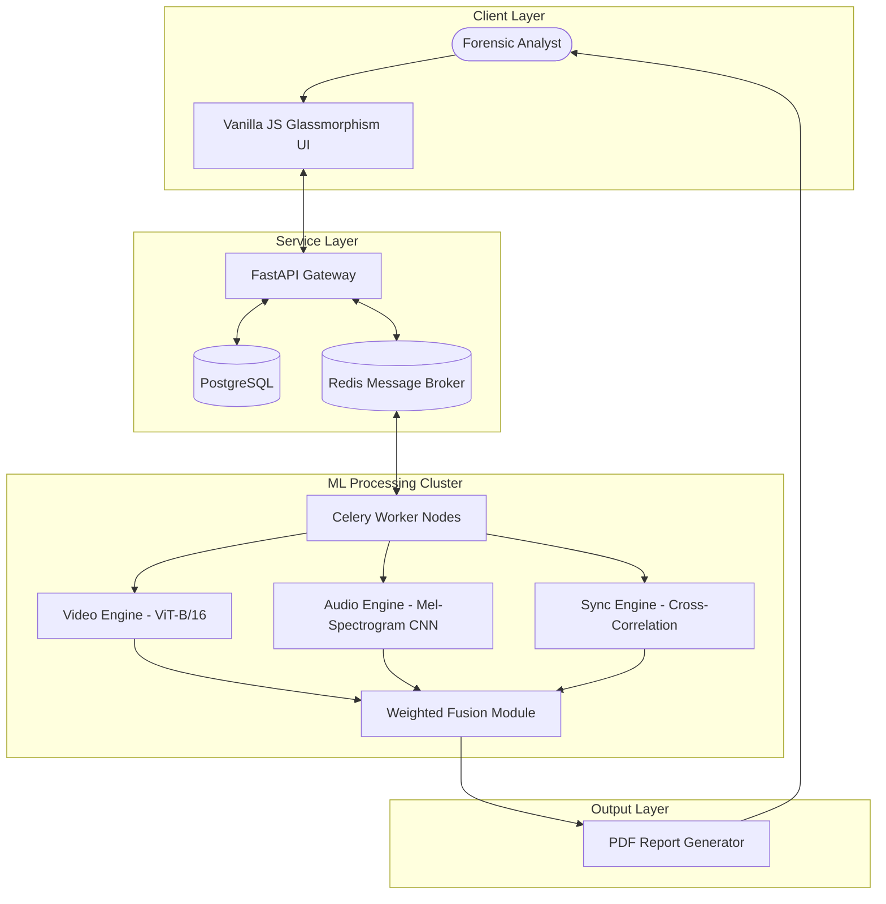
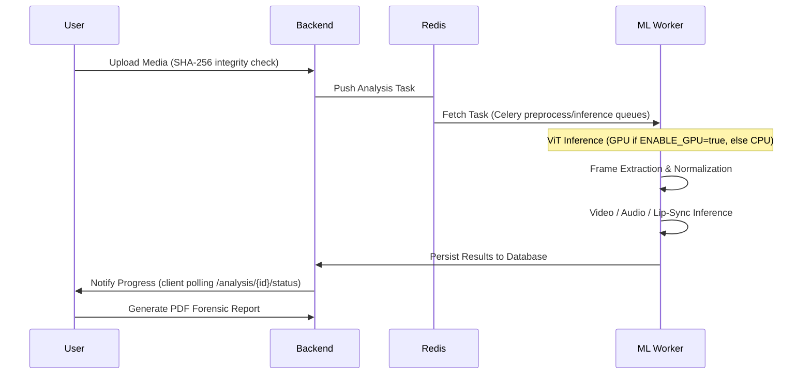

# 🛡️ DeepFakeShield AI: Multimodal Forensic Platform
## Technical Dissertation & Presentation Guide

> **Author:** Vanshika Tangri (Student No: 2315843)
> **Course:** AI-4-Creativity
> **Objective:** Comprehensive detection of manipulated media using multimodal AI analysis.

---

## 📖 1. Project Overview & Motivation
DeepFakeShield AI is an advanced forensic ecosystem designed to address the escalating threat of synthetic media. Unlike heuristic-based detectors, it leverages a **multimodal consensus mechanism** that analyzes the three primary dimensions of digital video:
1. **Visual Consistency** (Spatial & Temporal)
2. **Acoustic Authenticity** (Voice Synthesis & Cloning)
3. **Audio-Visual Alignment** (Lip-Sync Synchronization)

### The "Truth Score" Philosophy
The platform doesn't just output a binary "Fake" or "Real" label. It provides a **Forensic Confidence Score** based on calibrated probabilities across all modalities, allowing human investigators to verify the findings through an interactive evidence timeline.

---

## 🛠️ 2. Comprehensive Technology Stack

### A. AI & Machine Learning Infrastructure
| Component | Technology | Detail |
| :--- | :--- | :--- |
| **Video Model** | **ViT-B/16** | 12 Transformer layers, 12 heads, 768 hidden dim, fine-tuned on 140k Real and Fake Faces. |
| **Audio Model** | **Custom Mel-Spectrogram CNN** | 4-block Conv2d/BatchNorm/ReLU/MaxPool over an 80-bin Mel spectrogram, trained on ASVspoof 2019 LA. |
| **Sync Model** | **Mouth-Audio Cross-Correlation** | No trained network — cross-correlates mouth-openness signal with audio RMS envelope. |
| **Inference** | **PyTorch 2.2+** | CUDA-accelerated where available, CPU fallback otherwise. |
| **Computer Vision** | **OpenCV & PIL** | Haar Cascade face detection, frame extraction and spatial preprocessing. |

### B. Scalable Backend Architecture
| Component | Technology | Role |
| :--- | :--- | :--- |
| **API Layer** | **FastAPI** | High-concurrency async endpoints (Pydantic V2). |
| **Task Queue** | **Celery + Redis** | Distributed processing to handle heavy 4K video analysis. |
| **Database** | **PostgreSQL** | Relational storage for forensic metadata and user logs. |
| **Authentication** | **JWT (OAuth2)** | Secure stateless authentication for forensic analysts. |

---

## 🏗️ 3. Advanced System Architecture

### Distributed Processing Model
DeepFakeShield is designed to run in containerized environments, allowing the ML Worker to scale independently of the API server.

---

## 🧠 4. The Science Behind Detection

### Phase 1: Spatial & Temporal Feature Learning
Our **Vision Transformer (ViT-B/16)** model views a face crop as a sequence of 16x16 patches
(`ml/inference/video_forensics.py`). When a fine-tuned checkpoint is loaded, it classifies each
frame directly. When no checkpoint is present, the same backbone is used as a feature extractor:
per-frame feature vectors are compared for cosine-distance anomaly against the sequence mean and
against neighboring frames — deepfake video generated frame-by-frame tends to show higher
inter-frame feature variance than genuine video (Li & Lyu, 2019).

### Phase 2: Audio Spoof Detection
The trained path (`ml/inference/audio_spoof.py`) runs a custom CNN over an 80-bin Mel
spectrogram, trained on ASVspoof 2019 to discriminate bonafide from spoofed speech. The fallback
path computes real spectral features — MFCC variance, spectral flatness, harmonic-to-noise
ratio, zero-crossing rate — documented to differ between natural and synthesized speech
(Sahidullah et al., 2015).

### Phase 3: Cross-Modal Alignment (Lip-Sync)
The system cross-correlates a mouth-openness signal (from Haar Cascade face detection) against
the audio RMS energy envelope (`ml/inference/lipsync.py`). A sync offset above 80ms, or low
zero-lag correlation, is a high-confidence indicator of dubbing or reenactment. This stage
requires no trained weights and is skipped (returns `null`, not a fabricated score) when there
is no audio track or too few frames have a detected face.

---

## 📊 5. Multimodal Fusion Logic
The final verdict is calculated using a **Confidence-Weighted Ensemble**:

$$Score = \frac{\sum (ModalityScore_i \times Confidence_i)}{\sum Confidence_i}$$

| Modality | Default Weight | Key Signal |
| :--- | :--- | :--- |
| **Video** | 45% | Per-frame manipulation probability / inter-frame feature anomaly. |
| **Audio** | 30% | Spoof probability from Mel-CNN or spectral flatness/MFCC-variance heuristics. |
| **Lip-Sync** | 25% | Mouth-audio cross-correlation offset (ms). |

When a modality is unavailable (no audio track, no detected face), its weight is dropped and the
remaining weights are re-normalized rather than treated as a zero/authentic score
(`ml/inference/fusion.py`). The weights above are engineering defaults, not the result of a
completed calibration experiment — `MultimodalFusionService.calibrate()` exists in the code for
future grid-search tuning against labeled validation data but has not yet been run.

---

## 🔄 6. Process Lifecycle

---

## 📈 7. Reliability & Forensic Integrity

### Anti-Adversarial Measures
- **Input Sanitization:** Verifies MIME types and file signatures to prevent polyglot file attacks.
- **Data Integrity:** Every analysis result is linked to the **SHA-256 hash** of the original file to ensure chain of custody.
- **Explainability:** The platform highlights the specific **Evidence Segments** where the manipulation was most likely detected.

### Future Improvement Roadmap
1. **Active Learning Loop:** Automatically retraining models on newly discovered deepfake variations (e.g., Diffusion-based faces).
2. **Blockchain Notarization:** Registering authenticity certificates on a public ledger for immutable proof.
3. **Real-time Stream Analysis:** Extending the platform to monitor live video broadcasts for synthetic content injection.

---

## 📄 8. Conclusion
DeepFakeShield AI represents a significant step forward in the fight against digital misinformation. By combining state-of-the-art transformer architectures with traditional signal processing, it provides a comprehensive defense mechanism for the modern era.

---
*DeepFakeShield AI: Protecting Truth in the Age of Synthetic Media*
